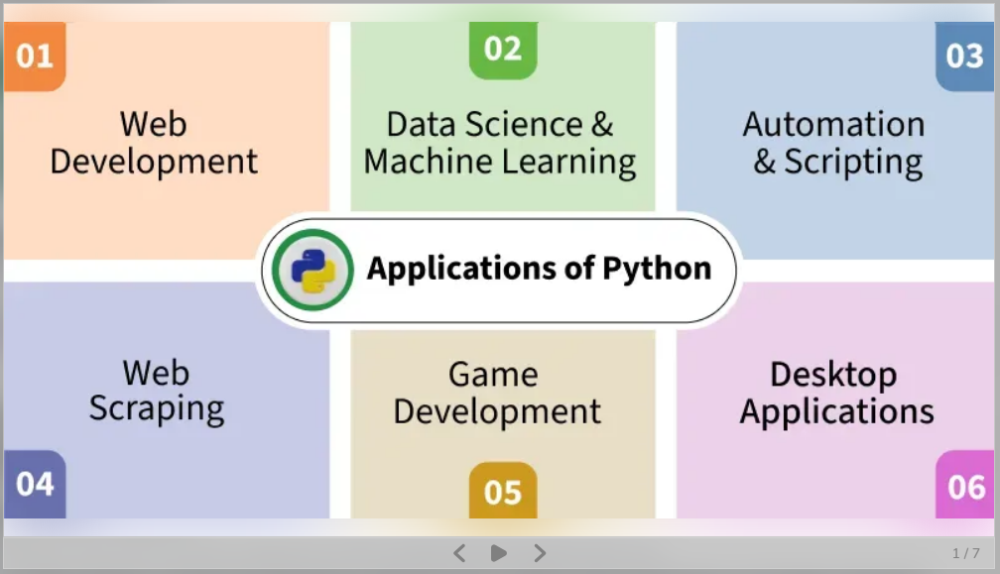
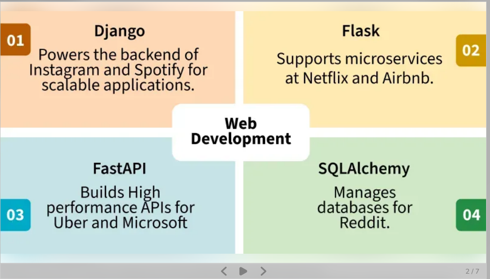
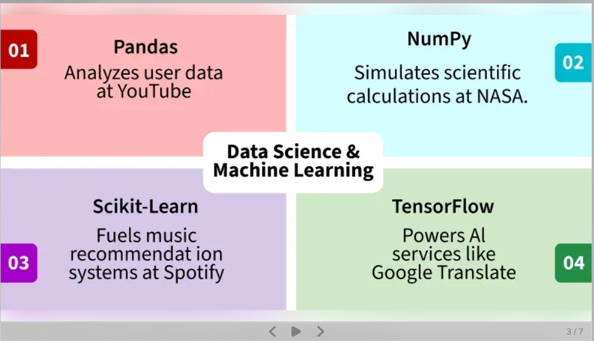
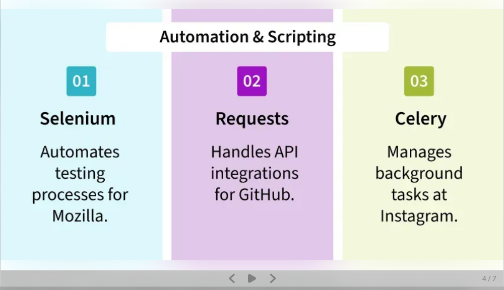
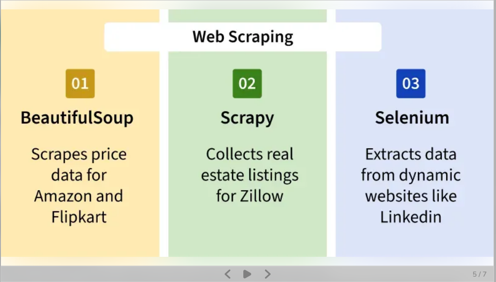
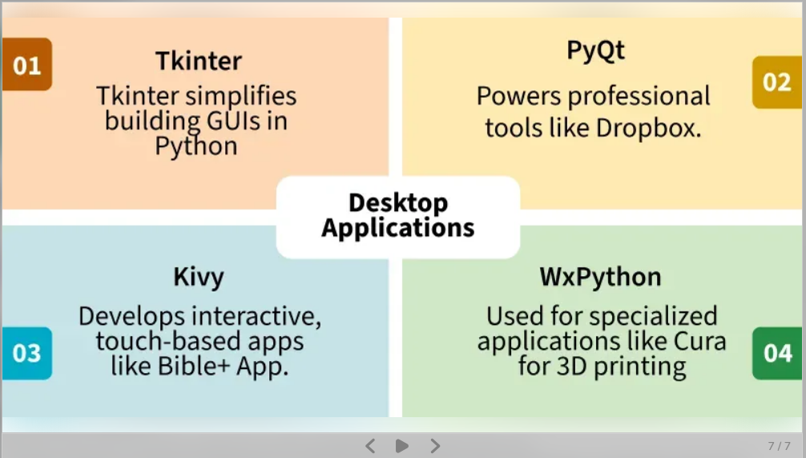
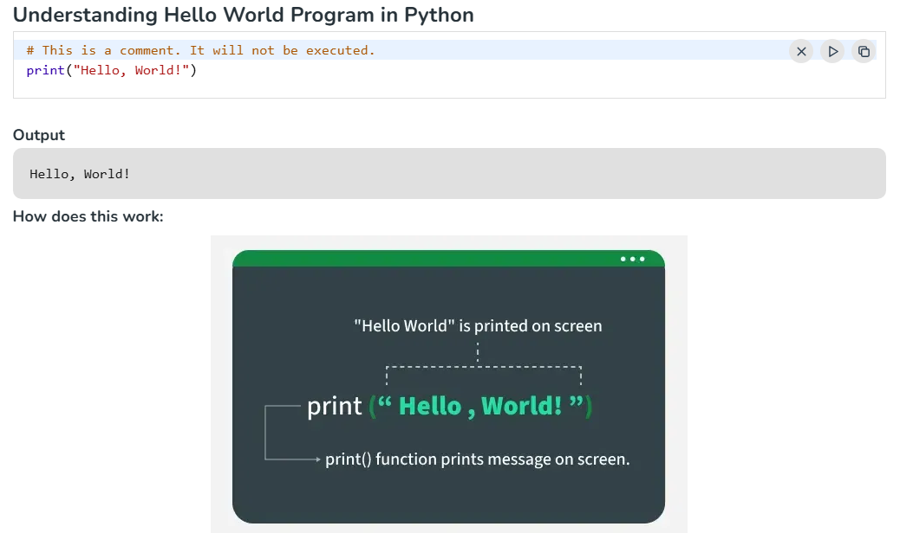
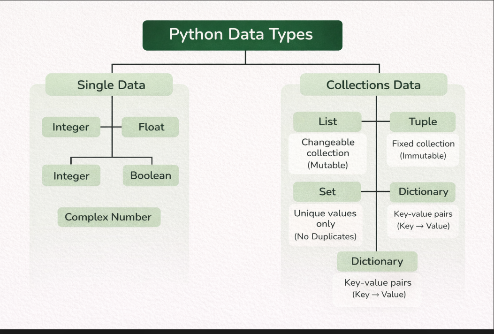

Python

Python is one of the most popular programming languages. It’s simple to use, packed with features and supported by a wide range of libraries and frameworks. Its clean syntax makes it beginner-friendly.

A high-level language, used in data science, automation, AI, web development and more.
Known for its readability, which means code is easier to write, understand and maintain.
Backed by strong library support, we don’t have to build everything from scratch.

Why Learn Python?

Requires fewer lines of code compared to other programming languages like Java.
Provides Libraries / Frameworks like Django, Flask and many more for Web Development, and Pandas, Tensorflow,

Python Introduction.

Python is a high-level programming language known for its simple and readable syntax. It has the following features.

Allows writing programs with fewer lines of code, improving readability.
Automatically detects variable types at runtime, eliminating the need for explicit declarations.
Used in web development, data analysis, automation, and many other fields.
Supports object-oriented, functional, and procedural programming styles.

data types in python

